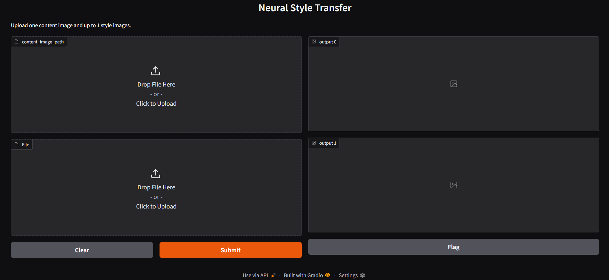
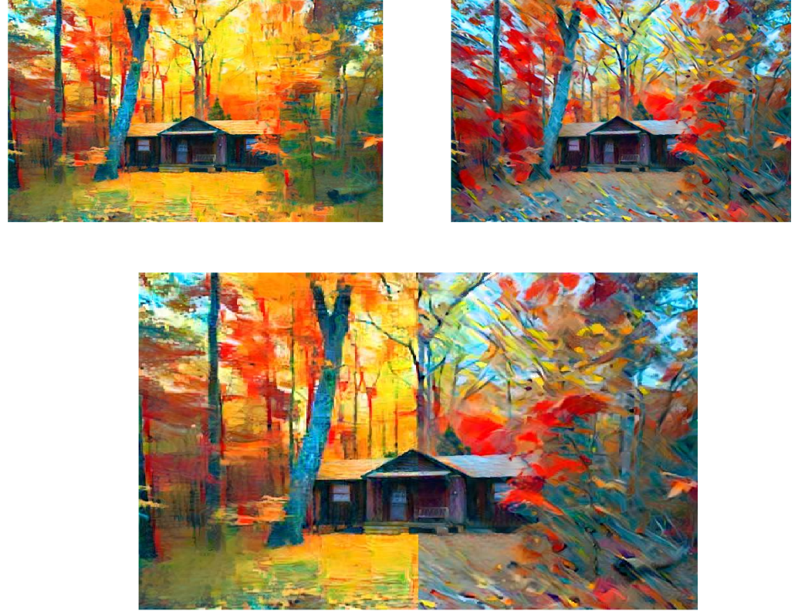

# Style-Transfer

**StyleTransfer** is a web application that allows users to apply artistic styles from one or more images onto a single content image. The application also segments and combines stylized outputs into a final merged image for seamless viewing.

---

## Overview

StyleTransfer enables users to:

- Upload a content image and multiple style images.
- Apply neural style transfer to generate stylized versions of the content image.
- Automatically segment and combine outputs based on the number of styles.
- Interact with the system through a user-friendly Gradio interface.

---

##  Description

This web application provides the following features:

- **Content and Style Uploads**: Users can upload one content image and up to `n` style images.
- **Multiple Stylizations**: Each style image is individually applied to the same content image.
- **Combined Output**: The stylized outputs are merged into a single image using segmentation for visual comparison.
- **Real-Time Inference**: The application uses GPU acceleration (if available) for faster results.
- **Interactive Web Interface**: Users can interactively upload images and view/download results.

---

## Tech Stack

- **Frontend**: Gradio (Python-based UI)
- **Backend**: PyTorch
- **Model**: Pretrained VGG-19
- **Image Processing**: Pillow, Matplotlib

---

## Instructions

1. **Upload the `.zip` file** to Google Colab 
2. Make sure the following libraries are installed before running the code:

```bash
pip install torch torchvision matplotlib gradio pillow numpy
```
3. Enable GPU acceleration
4. Choose the number of segments (style regions).
5. Click the Gradio link that appears.
6. In the Web Interface,
 
   -Click the Content window to upload the JPEG content image.
   
   -Click the Style window(s) to upload JPEG style images.
   
   -Press Submit to generate the stylized image.
   
   -Use the Clear button to remove uploaded content or style images.

---


##  Images






